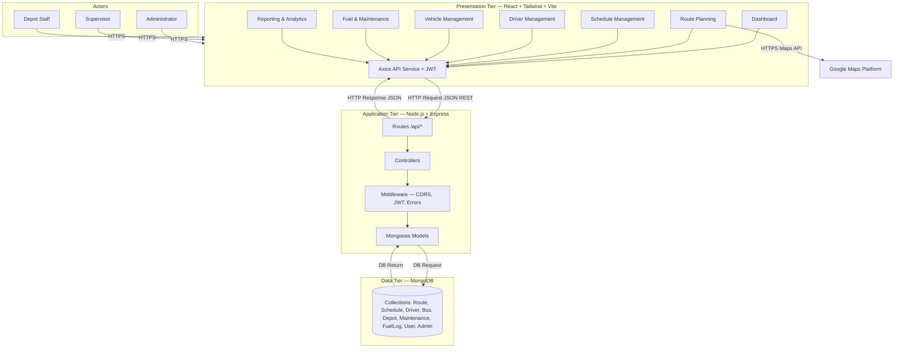

# TransitLK — Three-Tier Architecture

> **Smart Route Management and Scheduling System (SRMSS)**  
> Logical three-tier architecture with business modules, internal layers, and labeled interconnections.

---

## 1. Overview

TransitLK follows a **three-tier architecture**:

| Tier | Role | Technologies |
|------|------|----------------|
| **Presentation** | User interface, routing, API client | React, React Router, Tailwind CSS, Vite, Axios |
| **Application** | Business logic, REST API, security | Node.js, Express.js, JWT, Mongoose |
| **Data** | Persistent storage | MongoDB (Atlas in production) |

External services: **Google Maps Platform** (maps/geocoding from the browser), **GitHub** (version control), **Vercel** (frontend hosting), **Render** (backend hosting).

### Deployment & multi-depot roadmap

| Stage | Description |
|-------|-------------|
| **Single depot (now)** | MVP targets one operational depot. `scripts/seedDepot.js` creates **SRMSS Central Depot** and links buses/drivers. JWT + role guards secure modules per actor. |
| **Multi-depot (later)** | Add depots island-wide; assign each staff user, bus, and driver to a `depotId`; scope routes, schedules, and reports by depot; depot managers see only their depot; administrators see all. |

**Already in the data model:** `Depot`, optional `depotId` on `User`, `Admin`, `Bus`, `Driver`. **Not yet enforced:** depot filters on `Route` / `Schedule` APIs or UI; cross-depot admin views.

---

## 2. Actors

| Actor | Role key | Login collection | Default home |
|-------|----------|------------------|--------------|
| Administrator | `administrator` | `admins` | `/dashboard` |
| Transport Scheduler | `transport_scheduler` | `users` | `/routes` |
| Fleet Manager | `fleet_manager` | `users` | `/buses` |
| Depot Manager | `depot_manager` | `users` | `/dashboard` |
| Driver | `driver` | `drivers` (email + password) | `/my-trips` |

All actors sign in at `/login`. JWT protects every API except `POST /api/auth/login`. The React app blocks manual URL access to modules outside the user’s role.

---

## 3. Presentation Tier (Frontend)

**Location:** `client/`  
**Stack:** React + Tailwind CSS + Vite

### 3.1 Shared infrastructure

| Component | Path / purpose |
|-----------|----------------|
| React Router | `App.jsx` — page navigation |
| API service | `services/api.js` — Axios, base URL `/api`, JWT in `Authorization` |
| Layout | `AppLayout`, `Sidebar`, `Navbar` — shell UI |
| Styling | Tailwind CSS |

### 3.2 Business modules (UI)

| Module | Page(s) | Primary API |
|--------|---------|-------------|
| Dashboard | `Dashboard.jsx` | `/api/reports`, aggregated fleet/schedule data |
| Route Planning | `Routes.jsx`, `RouteMap.jsx` | `/api/routes` |
| Schedule Management | `Schedules.jsx` | `/api/schedules` |
| Driver Management | `Drivers.jsx` | `/api/drivers` |
| Vehicle / Bus Management | `Buses.jsx` | `/api/buses` |
| Fuel & Maintenance | `Maintenance.jsx` | `/api/maintenance`, `/api/fuel` |
| Reporting & Analytics | `Reports.jsx` | `/api/reports` (PDF export client-side) |

### 3.3 External integration (Presentation only)

**Route Planning** calls **Google Maps Platform** directly from the browser (`RouteMap.jsx`, `VITE_GOOGLE_MAPS_API_KEY`) for map display and geocoding. The backend does **not** proxy Google Maps requests.

---

## 4. Application Tier (Backend)

**Location:** `server/`  
**Stack:** Node.js + Express.js

### 4.1 Internal layers (top to bottom)

```
HTTP Request
    → Express middleware (CORS, JSON body parser)
    → Route handlers (/api/*)
    → Controllers (business logic)
    → Mongoose models (data access)
    → MongoDB
HTTP Response (JSON)
```

| Layer | Folder | Responsibility |
|-------|--------|----------------|
| Routes | `routes/` | Map URLs to controllers |
| Controllers | `controllers/` | Validation, business rules, responses |
| Middleware | `middleware/` | JWT `protect`, global `errorHandler` |
| Models | `models/` | Mongoose schemas and queries |

### 4.2 REST API modules

| API prefix | Module | Controller |
|------------|--------|------------|
| `/api/auth` | Authentication | `authController` |
| `/api/routes` | Route planning | `routeController` |
| `/api/schedules` | Schedules | `scheduleController` |
| `/api/drivers` | Drivers | `driverController` |
| `/api/buses` | Buses / fleet | `busController` |
| `/api/maintenance` | Maintenance | `maintenanceController` |
| `/api/fuel` | Fuel logs | `fuelController` |
| `/api/reports` | Reports & analytics | `reportController` |
| `/api/depots` | Depots | `depotController` |
| `/api/admins` | Admins | `adminController` |

**Health check:** `GET /api/health`

### 4.3 Cross-cutting concerns

- **Authentication:** JWT in `Authorization: Bearer <token>` (`authMiddleware.js`)
- **CORS:** Configured for frontend origin (e.g. `http://localhost:5173` in development)
- **Errors:** Centralized via `errorMiddleware.js`

---

## 5. Data Tier

**Technology:** MongoDB with **Mongoose ODM**  
**Connection:** `server/config/db.js` (`MONGODB_URI`)

### 5.1 Collections / entities

| Model | Domain |
|-------|--------|
| `User` | Login identity |
| `Admin` | Admin profiles |
| `Route` | Routes, stops, distances |
| `Schedule` | Timetables, trips |
| `Driver` | Driver profiles, licenses |
| `Bus` | Vehicle specs |
| `Depot` | Depot locations |
| `Maintenance` | Service records |
| `FuelLog` | Fuel usage per trip/route |

### 5.2 Data access flow

- **Application → Data:** Mongoose CRUD (find, create, update, delete) — label as **DB Request**
- **Data → Application:** Documents / query results — label as **DB Return**

Production typically uses **MongoDB Atlas** (managed cloud database).

---

## 6. Interconnections (labeled flows)

### 6.1 User ↔ Presentation

| Direction | Label |
|-----------|--------|
| User → UI | **HTTPS** — browser loads SPA |
| UI → User | **HTML/CSS/JS** — rendered React UI |

### 6.2 Presentation ↔ Application

| Direction | Protocol | Format | Notes |
|-----------|----------|--------|--------|
| Frontend → Backend | **HTTP Request** | **JSON** | REST over `/api/*` |
| Backend → Frontend | **HTTP Response** | **JSON** | Status codes, error messages |
| Auth | Header | `Authorization: Bearer <JWT>` | Via Axios interceptor |

**Example mappings:**

- Route Planning UI → `GET/POST/PUT/DELETE /api/routes`
- Schedules UI → `/api/schedules`
- Reports UI → `/api/reports`

### 6.3 Application ↔ Data

| Direction | Label |
|-----------|--------|
| Application → MongoDB | **DB Request** (Mongoose queries) |
| MongoDB → Application | **DB Return** (documents) |

### 6.4 Presentation ↔ Google Maps (external)

| Direction | Label |
|-----------|--------|
| Route Planning (`RouteMap`) → Google Maps | **HTTPS API** — Maps JavaScript / Geocoding |
| Google Maps → Route Planning | Map tiles, geocode results |

> **Note:** This is **not** routed through the Application tier in the current implementation.

---

## 7. Deployment architecture

```
                    ┌─────────────┐
                    │   GitHub    │
                    │  (monorepo) │
                    └──────┬──────┘
           ┌───────────────┼───────────────┐
           ▼               ▼               ▼
    ┌─────────────┐ ┌─────────────┐ ┌──────────────┐
    │   Vercel    │ │   Render    │ │ MongoDB Atlas│
    │  client/    │ │  server/    │ │   Database   │
    │  React SPA  │ │  Express API│ │              │
    └─────────────┘ └─────────────┘ └──────────────┘
```

| Artifact | Host | Environment (examples) |
|----------|------|-------------------------|
| Frontend build | Vercel | `VITE_API_URL`, `VITE_GOOGLE_MAPS_API_KEY` |
| Backend API | Render | `MONGODB_URI`, `JWT_SECRET`, `PORT` |
| Database | MongoDB Atlas | Connection string in backend |

---

## 8. Logical architecture diagram (Mermaid)

Use this in reports or export to PNG from [Mermaid Live](https://mermaid.live).



---

## 9. Comparison with previous diagram

| Item | Previous | Updated |
|------|----------|---------|
| Tier contents | Technology logos only | Business **modules** + internal **layers** |
| Return arrow | Labeled "HTTP Request" | **HTTP Response (JSON)** |
| Google Maps | Connected to Application tier | Connected to **Route Planning** in Presentation tier |
| Backend detail | Single "Express" box | Routes → Controllers → Middleware → Mongoose |
| Data tier | MongoDB logo only | Named **collections/entities** |
| Deployment | GitHub → Vercel + Render | Adds **MongoDB Atlas** and maps **client/** vs **server/** |

---

## 10. Related documentation

- [README.md](../README.md) — features and stack
- [docs/GROUP-REPORT.md](./GROUP-REPORT.md) — module wireframes
- [docs/ER-DIAGRAM.md](./ER-DIAGRAM.md) — entity relationships
- [docs/REQUIREMENTS.md](./REQUIREMENTS.md) — functional requirements

---

## 11. Diagram asset (coursework)

For submission, redraw the logical diagram in **Draw.io / Figma** using:

- Three dashed tier boxes (Presentation, Application, Data)
- Module rectangles inside Presentation and Application tiers
- Collection names inside Data tier
- Labeled arrows from Section 6
- Deployment strip below (GitHub → Vercel, Render, Atlas)

Replace or supplement the original architectural diagram PNG with an export from this specification.

---

## 12. Authentication and RBAC

- **Seed accounts:** `npm run seed:auth` in `server/` (see `docs/DEMO-SCRIPT.md`).
- **Frontend:** `AuthContext`, `RequireAuth`, `RoleGuard`, role config in `client/src/config/roles.js`.
- **Backend:** `protect` + `authorize` on all `/api/*` modules except auth login.
- **Driver trips:** `GET /api/schedules` auto-filters to `req.user.driverId` when role is `driver`.
