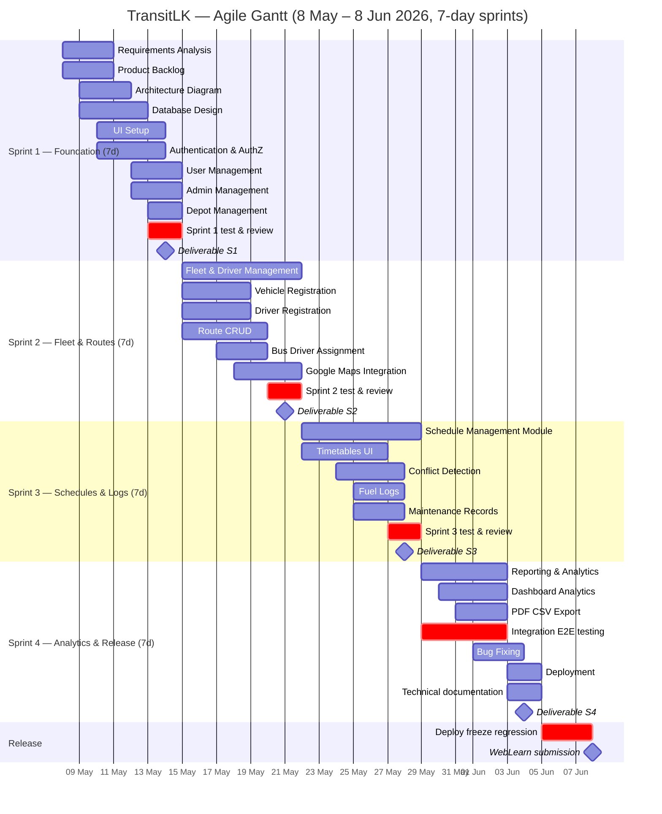

# TransitLK — Gantt Chart

**Product:** SRMSS (Smart Route Management and Scheduling System)  
**Period:** **8 May – 8 June 2026**  
**Sprint length:** **7 days** (4 sprints × 7 = 28 dev days)  
**Sprint tasks:** [`Timeline.md`](./Timeline.md)  
**Draw.io source:** [`TransitLK-Gantt-Chart.drawio`](./TransitLK-Gantt-Chart.drawio) — open in [diagrams.net](https://app.diagrams.net) → Export PNG  
**Regenerate:** `node "diagrams/Gantt Chart/_generate-gantt.mjs"`

---

## Chart specification

| Item | Detail |
|------|--------|
| Type | Agile sprint Gantt — 4 sprints, **parallel tasks** within each 7-day sprint |
| Time axis | 28 development days + deploy buffer (5–7 Jun) + submission (8 Jun) |
| Milestones | Working increment at end of each sprint + **8 Jun** submission |
| Exclude | Group report writing, presentation prep |

### Sprint dates (7-day weeks)

| Sprint | Dates | Days |
|--------|-------|------|
| Sprint 1 — Foundation | 8 – 14 May 2026 | 7 |
| Sprint 2 — Fleet & Routes | 15 – 21 May 2026 | 7 |
| Sprint 3 — Schedules & Logs | 22 – 28 May 2026 | 7 |
| Sprint 4 — Analytics & Release | 29 May – 4 Jun 2026 | 7 |
| Deploy & freeze | 5 – 7 Jun 2026 | 3 |
| Submission | 8 Jun 2026 | — |

### Colours

| Sprint | Hex |
|--------|-----|
| Sprint 1 | `#3B82F6` |
| Sprint 2 | `#22C55E` |
| Sprint 3 | `#F59E0B` |
| Sprint 4 | `#8B5CF6` |
| Testing | `#94A3B8` |
| Milestone | `#EF4444` |

### Sprint deliverables (working increments)

| Sprint | Increment |
|--------|-----------|
| 1 | Login, Users, Admins, Depots |
| 2 | Fleet, Routes, Maps |
| 3 | Schedules, Conflicts, Fuel & Maintenance |
| 4 | Analytics, Deploy, Technical docs |

---

## Agile compliance check

| Agile principle | Followed? | Evidence in this plan |
|-----------------|-----------|------------------------|
| Iterative sprints with shippable increments | **Yes** | 4 sprints; each ends with demo-ready deliverable |
| Parallel work (not waterfall) | **Yes** | Backend + frontend tasks overlap same days (e.g. Auth API + UI Setup days 3–6) |
| Continuous testing | **Yes** | `Sprint N test & review` in **every** sprint (S1-10 … S4-11), not only Sprint 4 |
| Product backlog drives work | **Yes** | Sprint 1 starts with backlog; tasks map to modules in `Timeline.md` |
| Time-boxed sprints | **Yes** | Fixed **7-day** boxes; scope adjusted per sprint goal |
| Deploy before deadline | **Yes** | Deployment 5–6 Jun; submission 8 Jun (no dev on submit day) |

| Anti-pattern | Avoided? |
|--------------|----------|
| Waterfall (all design → all build → all test) | **Yes** — design, build, and test overlap within each sprint |
| Testing only at project end | **Yes** — except Sprint 4 also has integration/E2E (expected for release) |
| No working software until final week | **Yes** — login works after Sprint 1, routes after Sprint 2, etc. |

**Note:** Sprint 4 includes deployment and technical documentation (README/API notes) — not the coursework group report.

---

## Task schedule

Day 1 = 8 May. Each sprint = **7 days**. Tasks **overlap** = parallel Agile work.

| ID | Task | Sprint | Start | Duration | End | Parallel track |
|----|------|--------|-------|----------|-----|----------------|
| — | Sprint 1 Planning | 1 | 1 | 1 | 1 | Ceremony |
| — | Sprint 2 Planning | 2 | 8 | 1 | 8 | Ceremony |
| — | Sprint 3 Planning | 3 | 15 | 1 | 15 | Ceremony |
| — | Sprint 4 Planning | 4 | 22 | 1 | 22 | Ceremony |
| — | Product Backlog Refinement | 1–4 | 5, 12, 19, 26 | 2 each | — | Ceremony |
| S1-01 | Requirements Analysis | 1 | 1 | 3 | 3 | Planning |
| S1-02 | Product Backlog | 1 | 1 | 3 | 3 | Planning |
| S1-03 | Architecture Diagram | 1 | 2 | 3 | 4 | Design |
| S1-04 | Database Design | 1 | 2 | 4 | 5 | Backend |
| S1-05 | UI Setup | 1 | 3 | 4 | 6 | Frontend |
| S1-06 | Authentication & Authorization | 1 | 3 | 4 | 6 | Backend + Frontend |
| S1-07 | User Management | 1 | 5 | 3 | 7 | Full-stack |
| S1-08 | Admin Management | 1 | 5 | 3 | 7 | Full-stack |
| S1-09 | Depot Management | 1 | 6 | 2 | 7 | Full-stack |
| S1-10 | Sprint 1 test & review | 1 | 6 | 2 | 7 | QA |
| S2-01 | Fleet & Driver Management | 2 | 8 | 7 | 14 | Module |
| S2-02 | Vehicle Registration | 2 | 8 | 4 | 11 | Backend |
| S2-03 | Driver Registration | 2 | 8 | 4 | 11 | Backend |
| S2-04 | Availability Tracking | 2 | 10 | 3 | 12 | Backend |
| S2-05 | Route Planning Module | 2 | 8 | 7 | 14 | Module |
| S2-06 | Route CRUD | 2 | 8 | 5 | 12 | Backend |
| S2-07 | Bus Assignment | 2 | 10 | 3 | 12 | Frontend |
| S2-08 | Driver Assignment | 2 | 10 | 3 | 12 | Frontend |
| S2-09 | Google Maps Integration | 2 | 11 | 4 | 14 | Frontend |
| S2-10 | Sprint 2 test & review | 2 | 13 | 2 | 14 | QA |
| S3-01 | Schedule Management Module | 3 | 15 | 7 | 21 | Module |
| S3-02 | Daily/Weekly/Monthly Timetables | 3 | 15 | 5 | 19 | Frontend |
| S3-03 | Route Scheduling | 3 | 16 | 4 | 19 | Backend |
| S3-04 | Driver Scheduling | 3 | 16 | 4 | 19 | Backend |
| S3-05 | Vehicle Scheduling | 3 | 16 | 4 | 19 | Backend |
| S3-06 | Conflict Detection | 3 | 17 | 4 | 20 | Backend |
| S3-07 | Fuel Logs | 3 | 18 | 3 | 20 | Full-stack |
| S3-08 | Maintenance Records | 3 | 18 | 3 | 20 | Full-stack |
| S3-09 | Sprint 3 test & review | 3 | 20 | 2 | 21 | QA |
| S4-01 | Reporting & Analytics | 4 | 22 | 5 | 26 | Module |
| S4-02 | Trip Completion Reports | 4 | 22 | 3 | 24 | Backend |
| S4-03 | Route Performance Reports | 4 | 22 | 3 | 24 | Backend |
| S4-04 | Fuel Consumption Reports | 4 | 23 | 3 | 25 | Backend |
| S4-05 | Dashboard Analytics | 4 | 23 | 4 | 26 | Full-stack |
| S4-06 | PDF/CSV Export | 4 | 24 | 3 | 26 | Frontend |
| S4-07 | Integration & E2E testing | 4 | 22 | 5 | 26 | QA |
| S4-08 | Bug Fixing | 4 | 25 | 3 | 27 | All |
| S4-09 | Deployment | 4 | 27 | 2 | 28 | DevOps |
| S4-10 | Technical documentation | 4 | 27 | 2 | 28 | Docs |
| S4-11 | Sprint 4 test & review | 4 | 26 | 2 | 27 | QA |
| — | User Acceptance Testing | Release | 29 | 3 | 31 | UAT |

---

## Mermaid Gantt (alternative — [mermaid.live](https://mermaid.live))

