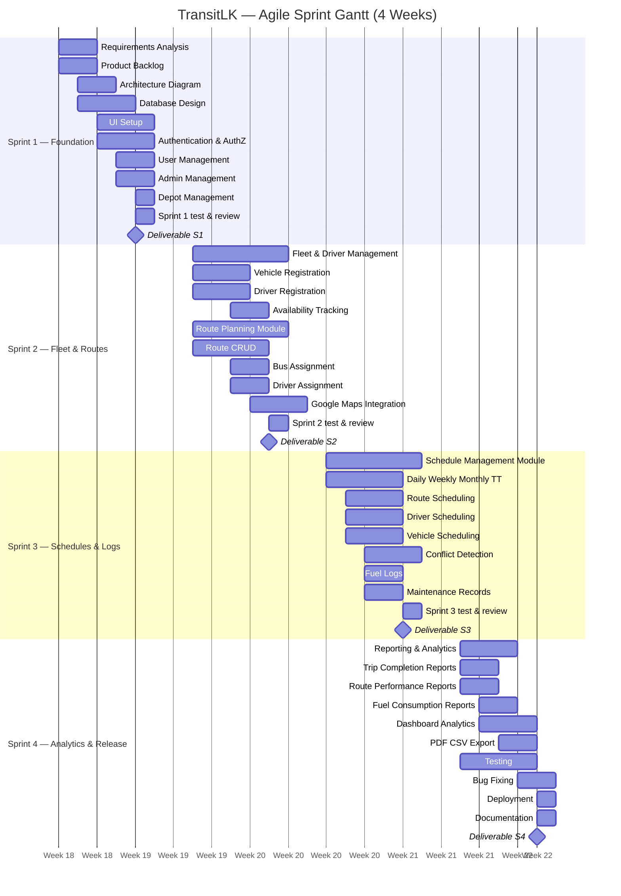

# TransitLK — Gantt Chart Drawing Guide

**Product:** Smart Route Management and Scheduling System (SRMSS)  
**Related file:** [`Timeline.md`](./Timeline.md)  
**Output file:** `TransitLK-Gantt-Chart.png` (or `.pdf` for the group report)

This guide explains how to draw the **Agile sprint Gantt chart** for TransitLK. Follow the steps in order. Use any tool listed in Section 3; **draw.io (diagrams.net)** is recommended for coursework.

---

## 1. What you are drawing

| Item | Detail |
|------|--------|
| **Chart type** | Agile sprint Gantt (4 sprints, parallel tasks within each week) |
| **Time axis** | 4 weeks × 5 working days = **20 days** |
| **Rows** | One row per task (see Section 5) |
| **Bars** | Horizontal bars showing when each task runs |
| **Milestones** | Deliverables at the **end of each sprint** (diamond or flag) |
| **Not included** | Report writing, presentation prep (outside development Gantt) |

### Agile rules (important for marking)

- Do **not** draw a waterfall chart (all design → all backend → all frontend).
- Tasks in the **same sprint overlap** (frontend and backend in parallel).
- **Testing** appears in **every sprint**, not only Week 4.
- Week 4 ends with deployment and final documentation.

---

## 2. Chart layout

### 2.1 Title block (top)

```
TransitLK — Agile Development Gantt Chart
Smart Route Management and Scheduling System (SRMSS)
Methodology: Agile (4 × 1-week sprints)
```

### 2.2 Time axis (top row)

Divide the chart into **4 sprint columns**. Each sprint has **5 day columns** (Mon–Fri).

| Sprint | Week label | Suggested calendar (optional) |
|--------|------------|--------------------------------|
| Sprint 1 | Week 1 | 7 May – 11 May 2026 |
| Sprint 2 | Week 2 | 14 May – 18 May 2026 |
| Sprint 3 | Week 3 | 21 May – 25 May 2026 |
| Sprint 4 | Week 4 | 28 May – 1 Jun 2026 |

Add a **milestone marker** after Week 4: **Submission / Final delivery**.

You may use **Week 1–4 only** (no dates) if your report does not require calendar dates.

### 2.3 Colour scheme

| Sprint | Bar colour | Hex (suggested) |
|--------|------------|-----------------|
| Sprint 1 — Foundation | Blue | `#3B82F6` |
| Sprint 2 — Fleet & Routes | Green | `#22C55E` |
| Sprint 3 — Schedules & Logs | Amber | `#F59E0B` |
| Sprint 4 — Analytics & Release | Purple | `#8B5CF6` |
| Testing (any sprint) | Light grey | `#94A3B8` |
| Milestones / deliverables | Red diamond | `#EF4444` |

### 2.4 Legend (bottom-right)

- Task bar = development work  
- Grey bar = test & review within sprint  
- ◆ = sprint deliverable  

### 2.5 Recommended size

- **Landscape A4** or **16:9 slide** (1920 × 1080 px)  
- Left column (task names): **35–40%** of width  
- Timeline grid: **60–65%** of width  

---

## 3. Choose your tool

| Tool | Best for | Section |
|------|----------|---------|
| **draw.io / diagrams.net** | Report figures, free, precise | § 4 |
| **Microsoft Excel / Google Sheets** | Quick bar chart from table | § 5 |
| **onlinegantt.com** | Web-based Gantt with export | § 6 |
| **Mermaid** | Markdown / GitHub preview | § 7 |

---

## 4. draw.io — step-by-step (recommended)

### Step 1 — Create file

1. Open [https://app.diagrams.net](https://app.diagrams.net).
2. **File → New diagram**.
3. Name: `TransitLK-Gantt-Chart.drawio`.
4. Save in: `diagrams/gantt-chart/`.

### Step 2 — Page setup

1. **File → Page setup** → Orientation: **Landscape**, Paper: **A4**.
2. Insert a **text** box at the top for the title (Section 2.1).

### Step 3 — Build the grid

1. Insert a large **table**: **25 rows × 21 columns**  
   - Row 1 = header (Sprint names merged over 5 day columns each)  
   - Row 2 = sub-header (Day 1–5 under each sprint)  
   - Rows 3–24 = task rows  
   - Row 25 = legend  
2. Merge cells for sprint headers:

   | Merged header | Spans |
   |---------------|-------|
   | Sprint 1 — Week 1 | 5 day columns |
   | Sprint 2 — Week 2 | 5 day columns |
   | Sprint 3 — Week 3 | 5 day columns |
   | Sprint 4 — Week 4 | 5 day columns |

3. Label day sub-headers: `D1` `D2` `D3` `D4` `D5` under each sprint.
4. Style header rows: fill `#1E3A5F`, white bold text.

### Step 4 — Add task names (left column)

Copy task names from **Section 5** into column 1 (rows 3–22). Group with **bold sprint labels** as separator rows:

```
── Sprint 1 ──
Requirements Analysis
Product Backlog
...
── Sprint 2 ──
Fleet & Driver Management
...
```

### Step 5 — Draw task bars

For each task in Section 5:

1. Use **Insert → Shape → Rectangle** (rounded corners optional).
2. Place the bar across the correct day cells (use table grid as guide).
3. Set fill colour from Section 2.3.
4. Set bar height ≈ 70% of row height; centre vertically in the row.
5. Add short label inside bar only if it fits; otherwise rely on row name.

**Tip:** Enable **View → Grid** and **Snap to grid** for aligned bars.

### Step 6 — Add milestone diamonds

At the **last day (D5)** of each sprint, on the deliverable row:

1. Insert **diamond** shape (flowchart → decision).
2. Colour red `#EF4444`.
3. Label next to diamond:

   | Sprint | Milestone label |
   |--------|-----------------|
   | 1 | Login, Users, Admins, Depots |
   | 2 | Fleet, Routes, Maps |
   | 3 | Schedules, Conflicts, Fuel & Maintenance |
   | 4 | Analytics, Deploy, Final docs |

### Step 7 — Sprint separators

Draw a **vertical dashed line** between Sprint 1|2, 2|3, 3|4, and after Sprint 4.

### Step 8 — Legend and export

1. Add legend (Section 2.4) bottom-right.
2. **File → Export as → PNG** (300 DPI) → `TransitLK-Gantt-Chart.png`.
3. Also export **PDF** for the report appendix.

---

## 5. Excel / Google Sheets — step-by-step

### Step 1 — Enter data

Create sheet `GanttData` with these columns:

| Column | Header | Example |
|--------|--------|---------|
| A | Task | Requirements Analysis |
| B | Sprint | 1 |
| C | Start day (1–20) | 1 |
| D | Duration (days) | 2 |
| E | End day | `=C2+D2-1` |
| F | Category | Planning |

Copy all rows from **Section 5.1** (full task table).

### Step 2 — Stacked bar chart

1. Select columns **Task**, **Start day**, **Duration**.
2. **Insert → Chart → Stacked bar chart** (horizontal).
3. Set **Start day** series to **no fill / transparent** (floating bar trick).
4. **Duration** series uses sprint colours (format by sprint number).

### Step 3 — Format axis

1. Horizontal axis: **1 to 20** (working days).
2. Add vertical gridlines at days **5, 10, 15, 20** (sprint boundaries).
3. Chart title: `TransitLK Agile Gantt Chart`.

### Step 4 — Export

Right-click chart → **Save as picture** → PNG for report.

---

## 6. onlinegantt.com — step-by-step

1. Go to [https://www.onlinegantt.com](https://www.onlinegantt.com) → **Create new project**.
2. Project name: `TransitLK SRMSS`.
3. Set timeline to **4 weeks** (or 7 May – 1 Jun 2026 if using dates).
4. For each task in Section 5.1, click **Add task**:
   - **Name** = Task column  
   - **Start / End** = use Start day and Duration (map day 1 → first Monday)  
   - **Group / Section** = Sprint 1, 2, 3, or 4  
5. Add **Milestones** on last day of each sprint (Section 4, Step 6 table).
6. Colour tasks by sprint group.
7. **Export → PNG/PDF**.

---

## 7. Mermaid Gantt (copy-paste)

Paste into any Mermaid-supported editor (GitHub, Notion, mermaid.live):



**Export from Mermaid Live:** [https://mermaid.live](https://mermaid.live) → paste code → **Export PNG/SVG**.

---

## 5. Complete task schedule (copy into any tool)

**Day key:** Day 1 = first day of Week 1. Each week = 5 days.

### 5.1 Task table

| ID | Task | Sprint | Start day | Duration | End day | Deliverable |
|----|------|--------|-----------|----------|---------|-------------|
| S1-01 | Requirements Analysis | 1 | 1 | 2 | 2 | |
| S1-02 | Product Backlog | 1 | 1 | 2 | 2 | |
| S1-03 | Architecture Diagram | 1 | 2 | 2 | 3 | |
| S1-04 | Database Design | 1 | 2 | 3 | 4 | |
| S1-05 | UI Setup | 1 | 3 | 3 | 5 | |
| S1-06 | Authentication & Authorization | 1 | 3 | 3 | 5 | |
| S1-07 | User Management | 1 | 4 | 2 | 5 | |
| S1-08 | Admin Management | 1 | 4 | 2 | 5 | |
| S1-09 | Depot Management | 1 | 5 | 1 | 5 | |
| S1-10 | Sprint 1 test & review | 1 | 5 | 1 | 5 | |
| **M1** | **Sprint 1 deliverables** | **1** | **5** | **0** | **5** | Login, Users, Admins, Depots |
| S2-01 | Fleet & Driver Management | 2 | 6 | 5 | 10 | |
| S2-02 | Vehicle Registration | 2 | 6 | 3 | 8 | |
| S2-03 | Driver Registration | 2 | 6 | 3 | 8 | |
| S2-04 | Availability Tracking | 2 | 8 | 2 | 9 | |
| S2-05 | Route Planning Module | 2 | 6 | 5 | 10 | |
| S2-06 | Route CRUD | 2 | 6 | 4 | 9 | |
| S2-07 | Bus Assignment | 2 | 8 | 2 | 9 | |
| S2-08 | Driver Assignment | 2 | 8 | 2 | 9 | |
| S2-09 | Google Maps Integration | 2 | 9 | 3 | 10 | |
| S2-10 | Sprint 2 test & review | 2 | 10 | 1 | 10 | |
| **M2** | **Sprint 2 deliverables** | **2** | **10** | **0** | **10** | Fleet, Routes, Maps |
| S3-01 | Schedule Management Module | 3 | 11 | 5 | 15 | |
| S3-02 | Daily/Weekly/Monthly Timetables | 3 | 11 | 4 | 14 | |
| S3-03 | Route Scheduling | 3 | 12 | 3 | 14 | |
| S3-04 | Driver Scheduling | 3 | 12 | 3 | 14 | |
| S3-05 | Vehicle Scheduling | 3 | 12 | 3 | 14 | |
| S3-06 | Conflict Detection | 3 | 13 | 3 | 15 | |
| S3-07 | Fuel Logs | 3 | 13 | 2 | 14 | |
| S3-08 | Maintenance Records | 3 | 13 | 2 | 14 | |
| S3-09 | Sprint 3 test & review | 3 | 15 | 1 | 15 | |
| **M3** | **Sprint 3 deliverables** | **3** | **15** | **0** | **15** | Schedules, Conflicts, Fuel & Maintenance |
| S4-01 | Reporting & Analytics | 4 | 16 | 3 | 18 | |
| S4-02 | Trip Completion Reports | 4 | 16 | 2 | 17 | |
| S4-03 | Route Performance Reports | 4 | 16 | 2 | 17 | |
| S4-04 | Fuel Consumption Reports | 4 | 17 | 2 | 18 | |
| S4-05 | Dashboard Analytics | 4 | 17 | 3 | 19 | |
| S4-06 | PDF/CSV Export | 4 | 18 | 2 | 19 | |
| S4-07 | Testing | 4 | 16 | 4 | 19 | |
| S4-08 | Bug Fixing | 4 | 19 | 2 | 20 | |
| S4-09 | Deployment | 4 | 20 | 1 | 20 | |
| S4-10 | Documentation | 4 | 20 | 1 | 20 | |
| S4-11 | Sprint 4 test & review | 4 | 19 | 2 | 20 | |
| **M4** | **Sprint 4 deliverables** | **4** | **20** | **0** | **20** | Analytics, Reports, Deploy, Final docs |

### 5.2 Day-to-week conversion

| Day range | Week |
|-----------|------|
| 1 – 5 | Week 1 (Sprint 1) |
| 6 – 10 | Week 2 (Sprint 2) |
| 11 – 15 | Week 3 (Sprint 3) |
| 16 – 20 | Week 4 (Sprint 4) |

**Example:** Task S2-07 (Bus Assignment) — Start day **8**, Duration **2** → Week 2, **D3–D4**.

---

## 8. Visual bar map (quick reference for draw.io)

Use this ASCII map when placing bars. Each `#` = 1 day; `.` = empty.

```
Sprint 1 (Days 1-5)
S1-01 Requirements Analysis     ##...
S1-02 Product Backlog           ##...
S1-03 Architecture Diagram      .##..
S1-04 Database Design           .###.
S1-05 UI Setup                  ..###
S1-06 Auth & Authorization      ..###
S1-07 User Management           ...##
S1-08 Admin Management          ...##
S1-09 Depot Management          ....#
S1-10 Sprint 1 test             ....#

Sprint 2 (Days 6-10)
S2-01 Fleet & Driver Mgmt       ##### 
S2-02 Vehicle Registration      ###..
S2-03 Driver Registration       ###..
S2-04 Availability Tracking     ..##.
S2-05 Route Planning Module     #####
S2-06 Route CRUD                ####.
S2-07 Bus Assignment            ..##.
S2-08 Driver Assignment         ..##.
S2-09 Google Maps Integration   ...###
S2-10 Sprint 2 test             ....#

Sprint 3 (Days 11-15)
S3-01 Schedule Module           #####
S3-02 Daily/Weekly/Monthly      ####.
S3-03 Route Scheduling          .###.
S3-04 Driver Scheduling         .###.
S3-05 Vehicle Scheduling        .###.
S3-06 Conflict Detection        ..###
S3-07 Fuel Logs                 ..##.
S3-08 Maintenance Records       ..##.
S3-09 Sprint 3 test             ....#

Sprint 4 (Days 16-20)
S4-01 Reporting & Analytics     ###..
S4-02 Trip Completion Reports   ##...
S4-03 Route Performance         ##...
S4-04 Fuel Consumption          .##..
S4-05 Dashboard Analytics       .###.
S4-06 PDF/CSV Export            ..##.
S4-07 Testing                   ########
S4-08 Bug Fixing                ....##
S4-09 Deployment                .....#
S4-10 Documentation             .....#
S4-11 Sprint 4 test             ...###
```

---

## 9. Checklist before submitting the diagram

- [ ] Title and methodology label are visible  
- [ ] Four sprints clearly separated (Week 1–4)  
- [ ] All tasks from [`Timeline.md`](./Timeline.md) appear on the chart  
- [ ] Tasks within a sprint **overlap** (parallel work shown)  
- [ ] Each sprint has a **test & review** bar  
- [ ] Four **deliverable milestones** marked at end of each sprint  
- [ ] Legend and colour coding included  
- [ ] Exported as **PNG** (300 DPI) or **PDF** for the group report  
- [ ] Saved source file in `diagrams/gantt-chart/`  

---

## 10. Files in this folder

| File | Purpose |
|------|---------|
| [`Timeline.md`](./Timeline.md) | Sprint tasks and deliverables (text) |
| [`Gantt.md`](./Gantt.md) | This drawing guide |
| `TransitLK-Gantt-Chart.drawio` | draw.io source *(create when drawing)* |
| `TransitLK-Gantt-Chart.png` | Exported figure for report *(create when drawing)* |

---

*End of Gantt chart guide*
