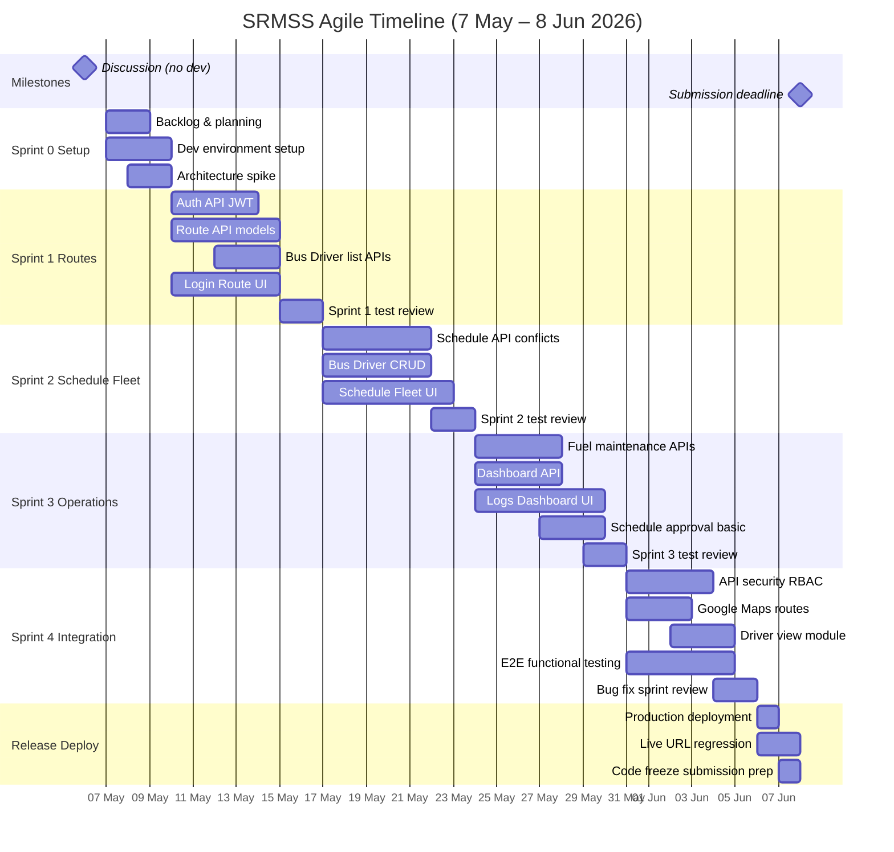

# SRMSS — Agile Project Timeline & Sprint Plan

**TransitLK | CS6003 Coursework-1**  
**Methodology:** Agile (Scrum-style sprints)  
**Discussion / brief:** 6 May 2026  
**Development start:** 7 May 2026 (work begins after discussion)  
**Submission deadline:** 8 June 2026  
**Development window:** 7 May – 7 June 2026 (~4.5 weeks)  
**Team size:** 3 members

> Use this document for the **Timeline** section (before the Gantt chart) in your group report.  
> Do **not** use a waterfall Gantt (all design → all backend → all frontend). Agile plans work in **sprints** with **parallel development and testing** each iteration.

---

## Project milestones

| Date | Milestone |
|------|-----------|
| **6 May 2026** | Group discussion / requirements alignment with lecturer *(not counted as development)* |
| **7 May 2026** | **Day 1** — Sprint 0 starts (repo, backlog, environments) |
| **15 May 2026** | Sprint 1 review — login + routes working |
| **22 May 2026** | Sprint 2 review — schedules + fleet working |
| **29 May 2026** | Sprint 3 review — dashboard + fuel/maintenance working |
| **5 June 2026** | Sprint 4 review — integration, JWT/RBAC, E2E tests |
| **6–7 June 2026** | **Deployment & final testing** (live URL + GitHub frozen) |
| **8 June 2026** | **Submission** — report, video, GitHub link on WebLearn |

---

## Why the previous Gantt was incorrect

| Waterfall-style plan (incorrect for Agile) | Agile plan (correct) |
|--------------------------------------------|----------------------|
| Finish all analysis, then all design, then all backend | Each sprint delivers a **working increment** |
| Frontend starts only after backend ends | Frontend and backend work **in parallel** within the same sprint |
| Testing only in one phase at the end | **Test continuously** in every sprint |
| Separate “Documentation” phase on the chart | Documentation is **outside** this development Gantt (report in parallel; submit 8 Jun) |
| Timeline ending after submission | Plan must **end on 8 Jun** with deploy **before** that date |

---

## 1. Project timeline (high-level)

Development deliverables only. Report writing runs in parallel but is **not** on this Gantt.

| Period | Sprint | Goal (increment) | Outcome |
|--------|--------|------------------|---------|
| **7–9 May 2026** | Sprint 0 — Setup & backlog | Kick-off after 6 May discussion; environments, backlog | Repo, MongoDB, React shell, prioritized stories |
| **10–16 May 2026** | Sprint 1 — Foundation & routes | Login, JWT, route CRUD, bus/driver lists | Log in; create routes; manual bus/driver assign |
| **17–23 May 2026** | Sprint 2 — Scheduling & fleet | Schedules, basic conflict checks, bus/driver CRUD | Build timetables; maintain fleet data |
| **24–30 May 2026** | Sprint 3 — Operations | Dashboard, fuel & maintenance, approval (basic) | Depot view; logs; draft approval flow |
| **31 May – 5 Jun 2026** | Sprint 4 — Integration & hardening | Secure APIs, RBAC, maps (if time), E2E tests | Stable integrated app on localhost/staging |
| **6–7 Jun 2026** | Release — Deploy & freeze | Production/staging deploy, regression, demo prep | **Live link ready** for submission |
| **8 Jun 2026** | — | **Submission** (no new dev) | Upload report + GitHub + working system link |

**Best time for deployment:** **6 June 2026** (primary), with **7 June** as buffer for fixes. Do not leave first deploy until 8 June — that is submission day only.

**Agile ceremonies (lightweight):**

- **Daily stand-up** (~15 min)  
- **Sprint planning** — start of each sprint (7, 10, 17, 24, 31 May)  
- **Sprint review** — end of each sprint (9, 16, 23, 30 May, 5 Jun)  
- **Retrospective** — after each review  

---

## 2. Product backlog (development only)

| ID | User story (summary) | Priority | Sprint |
|----|----------------------|----------|--------|
| US-01 | As Admin, I can log in securely (JWT) | P1 | 1 |
| US-02 | As Transport Scheduler, I can create/edit routes | P1 | 1 |
| US-03 | As Transport Scheduler, I can assign bus and driver (manual + validation) | P1 | 1 |
| US-04 | As Fleet Manager, I can register and update buses | P1 | 2 |
| US-05 | As Fleet Manager, I can register and update drivers | P1 | 2 |
| US-06 | As Transport Scheduler, I can create schedules | P1 | 2 |
| US-07 | As Transport Scheduler, I see scheduling conflicts | P1 | 2 |
| US-08 | As Fleet Manager, I can log fuel and maintenance | P1 | 3 |
| US-09 | As Depot Manager, I can view depot dashboard | P1 | 3 |
| US-10 | As Depot Manager, I can approve/reject draft schedules | P2 | 3 |
| US-11 | As user, I see routes on a map (Google Maps) | P2 | 4 |
| US-12 | As Admin, role-based access to modules | P2 | 4 |
| US-13 | As Driver, I can view assigned trips (read-only) | P2 | 4 |
| US-14 | Integrated app passes functional test scenarios | P1 | 4 + Release |

---

## 3. Sprint breakdown (parallel work)

### Sprint 0 — Setup & backlog (7–9 May)

| Track | Tasks |
|-------|--------|
| **All** | Confirm scope from 6 May discussion; GitHub; Notion backlog |
| **Backend** | Express, MongoDB, folder structure |
| **Frontend** | React + Vite, layout, sidebar |
| **Design spike** | Core use cases + ER for Sprint 1 only |

### Sprint 1 — Foundation & routes (10–16 May)

| Member | Backend | Frontend | Test (same sprint) |
|--------|---------|----------|-------------------|
| **Baanu** | Auth API, JWT, Route API | Login, Routes pages | Login + route tests |
| **Irfa** | Bus/Driver list APIs | Bus/driver dropdowns on route form | Assignment validation |
| **Member 3** | API client | App shell, smoke tests | Postman |

**Demo:** Log in → create route → assign bus/driver.

### Sprint 2 — Scheduling & fleet (17–23 May)

| Member | Backend | Frontend | Test (same sprint) |
|--------|---------|----------|-------------------|
| **Baanu** | Schedule API, overlap check | Schedule UI | Schedule CRUD |
| **Irfa** | Bus/Driver CRUD | Fleet & Drivers pages | Fleet tests |
| **Member 3** | Integration wiring | Navigation | Integration tests |

**Demo:** Create schedule; maintain buses/drivers.

### Sprint 3 — Operations (24–30 May)

| Member | Backend | Frontend | Test (same sprint) |
|--------|---------|----------|-------------------|
| **Baanu** | Schedule status / approval flags | Approval UI (basic) | Approval test |
| **Irfa** | Fuel + maintenance APIs | Fuel/maintenance UI | Log tests |
| **Member 3** | Dashboard API | Dashboard page | Dashboard test |

**Demo:** Dashboard + fuel/maintenance.

### Sprint 4 — Integration (31 May – 5 Jun)

| Track | Tasks |
|-------|--------|
| **All** | `protect` on APIs; RBAC; bug fixes from Sprints 1–3 |
| **Backend** | Maps API (if time); conflict rules |
| **Frontend** | Map on routes; driver read-only view |
| **QA** | E2E functional tests |

**Optional staging deploy:** 3–4 June (test Atlas + hosting before final deploy).

### Release — Deploy & freeze (6–7 Jun)

| Day | Tasks |
|-----|--------|
| **6 Jun** | Deploy backend + frontend (e.g. Render/Railway + Atlas); smoke test live URL |
| **7 Jun** | Regression fixes; freeze `main` branch; confirm GitHub link for report |
| **8 Jun** | Submit — no new features |

---

## 4. Agile Gantt chart (for report & onlinegantt.com)

**Axis:** 7 May 2026 → 8 June 2026 (submission marker on 8 Jun, no dev tasks that day).

### Text view (copy into Gantt tool)

```
MILESTONE: 6 May — Discussion (informational only, not development)

SECTION: Sprint 0 — Setup & Backlog (7–9 May)
  S0.1  Sprint planning & backlog (post-discussion)
  S0.2  Dev environment setup (GitHub, MongoDB, React)
  S0.3  Architecture spike (3-tier, core entities)

SECTION: Sprint 1 — Foundation & Routes (10–16 May)
  S1.1  User auth API + JWT
  S1.2  Route API + Mongoose models
  S1.3  Bus/Driver list APIs
  S1.4  Login UI + auth integration
  S1.5  Route management UI + manual assign
  S1.6  Sprint 1 test & review

SECTION: Sprint 2 — Scheduling & Fleet (17–23 May)
  S2.1  Schedule API + conflict validation
  S2.2  Bus/Driver CRUD APIs
  S2.3  Schedule UI
  S2.4  Fleet management UI
  S2.5  Sprint 2 test & review

SECTION: Sprint 3 — Dashboard & Logs (24–30 May)
  S3.1  Fuel & maintenance APIs
  S3.2  Dashboard API
  S3.3  Fuel/maintenance UI
  S3.4  Dashboard UI
  S3.5  Schedule approval (basic)
  S3.6  Sprint 3 test & review

SECTION: Sprint 4 — Integration (31 May – 5 Jun)
  S4.1  Secure APIs (JWT + RBAC)
  S4.2  Google Maps on routes (if time)
  S4.3  Driver view-only module
  S4.4  End-to-end functional testing
  S4.5  Bug fixing & sprint review

SECTION: Release — Deploy (6–7 Jun)
  S5.1  Staging/production deployment
  S5.2  Live URL regression testing
  S5.3  Code freeze & submission prep

MILESTONE: 8 Jun — Submission (report + GitHub + live link)
```

### Mermaid Gantt



---

## 5. Deployment timing (summary)

| When | What |
|------|------|
| **6 May** | Discussion only — align scope; **no deployment** |
| **7 May** | Start development (Sprint 0) |
| **3–4 Jun** *(optional)* | Staging deploy — test hosting early |
| **6 Jun** | **Main deployment** — backend + DB + frontend live |
| **7 Jun** | Fix production bugs; freeze code; verify GitHub link |
| **8 Jun** | **Submit** — upload report; link must already work |

---

## 6. Team responsibilities (aligned to sprints)

| Member | Primary modules | Sprint focus |
|--------|-----------------|--------------|
| **Baanu** | Auth, Routes, Schedules | Sprints 1–2 lead; 3–4 support |
| **Irfa** | Buses, Drivers, Fuel, Maintenance | Sprints 1–3 lead |
| **Member 3** *(name)* | Dashboard, integration, deploy, testing | Sprints 3–4 + **deploy 6–7 Jun** |

---

## 7. What to put in the group report

1. Methodology & justification (Agile)  
2. Note: **Discussion 6 May → development from 7 May → submission 8 June**  
3. **Timeline** — Section 1 + milestones table  
4. **Agile Gantt** — Section 4 (ends 7 Jun deploy; milestone 8 Jun submit)  
5. Responsibilities & risk analysis  

**Do not** extend the Gantt past 8 June with development tasks. **Do not** put report writing on the development Gantt.

---

## Related files

- [`GROUP-REPORT.md`](./GROUP-REPORT.md)  
- [`REQUIREMENTS.md`](./REQUIREMENTS.md)  
- [`DOCUMENT.md`](./DOCUMENT.md)  

---

*Timeline aligned to: discussion 6 May 2026, start 7 May 2026, submit 8 June 2026.*
