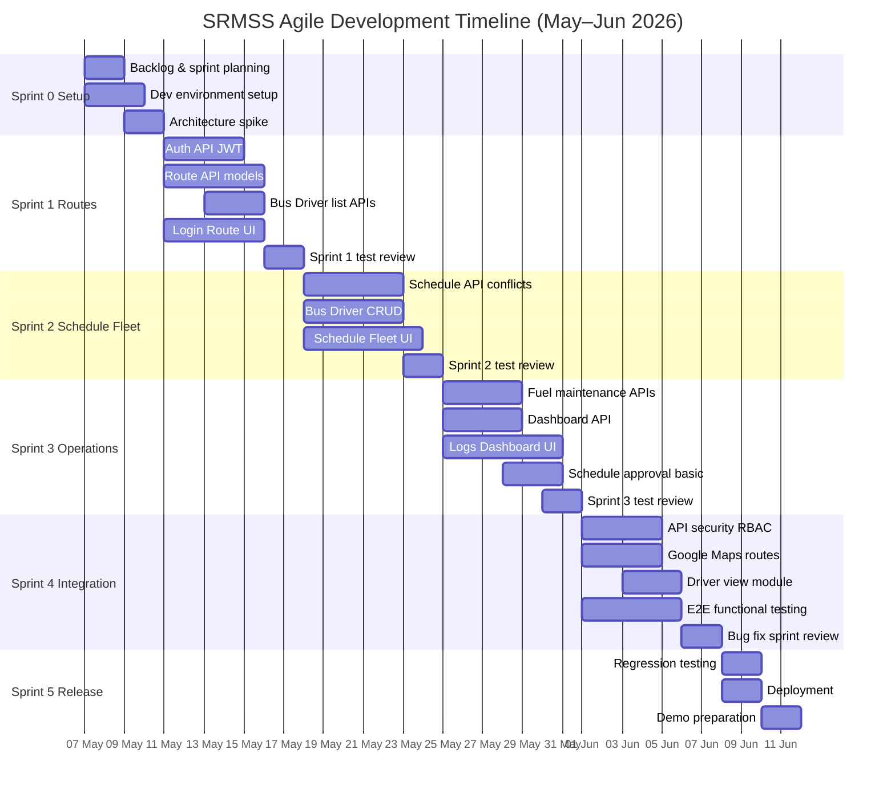

# SRMSS — Agile Project Timeline & Sprint Plan

**TransitLK | CS6003 Coursework-1**  
**Methodology:** Agile (Scrum-style sprints)  
**Project duration:** 7 May 2026 – 11 June 2026 (~5 weeks)  
**Team size:** 3 members

> Use this document for the **Timeline** section (before the Gantt chart) in your group report.  
> Do **not** use a waterfall Gantt (all design → all backend → all frontend). Agile plans work in **sprints** with **parallel development and testing** each iteration.

---

## Why the previous Gantt was incorrect

| Waterfall-style plan (incorrect for Agile) | Agile plan (correct) |
|--------------------------------------------|----------------------|
| Finish all analysis, then all design, then all backend | Each sprint delivers a **working increment** |
| Frontend starts only after backend ends | Frontend and backend work **in parallel** within the same sprint |
| Testing only in one phase at the end | **Test continuously** in every sprint |
| Separate “Documentation” phase on the chart | Documentation is **outside** this development timeline (report is coursework deliverable, not a sprint deliverable) |
| One long “System Design” block before coding | **Just-enough design** per sprint (spikes), then implement |

---

## 1. Project timeline (high-level)

This timeline shows **what the team delivers and when**, not documentation tasks.

| Period | Sprint | Goal (increment) | Outcome |
|--------|--------|------------------|---------|
| **7 May – 10 May 2026** | Sprint 0 — Setup & backlog | Project kick-off, environments, prioritized backlog | Repo, MongoDB, React shell, user stories ready |
| **11 May – 17 May 2026** | Sprint 1 — Foundation & routes | Login, roles, route CRUD, bus/driver lists for assignment | Users can log in and create/manage routes with manual bus/driver pick |
| **18 May – 24 May 2026** | Sprint 2 — Scheduling & fleet core | Schedules, conflict checks (basic), bus & driver management | Scheduler can build timetables; fleet data maintained |
| **25 May – 31 May 2026** | Sprint 3 — Operations & depot view | Dashboard, fuel & maintenance logs, schedule approval flow (draft) | Depot manager can monitor depot; fleet logs fuel/maintenance |
| **1 Jun – 7 Jun 2026** | Sprint 4 — Integration & hardening | Full FE–BE integration, JWT on APIs, maps, RBAC, regression testing | End-to-end flows stable for demo |
| **8 Jun – 11 Jun 2026** | Sprint 5 — Release prep | Bug fixes, performance checks, deployment, sprint review / demo | Working system on GitHub; ready for presentation |

**Agile ceremonies (lightweight, whole project):**

- **Daily stand-up** (~15 min): yesterday / today / blockers  
- **Sprint planning** (start of each sprint): select stories from backlog  
- **Sprint review** (end of each sprint): demo increment to the team  
- **Retrospective** (end of each sprint): what to improve next sprint  

---

## 2. Product backlog (development only)

Stories are grouped by module. Priority **P1** = must have for MVP demo.

| ID | User story (summary) | Priority | Sprint |
|----|----------------------|----------|--------|
| US-01 | As Admin, I can log in securely (JWT) | P1 | 1 |
| US-02 | As Transport Scheduler, I can create/edit routes (stops, distance) | P1 | 1 |
| US-03 | As Transport Scheduler, I can assign bus and driver to a route (manual + validation) | P1 | 1 |
| US-04 | As Fleet Manager, I can register and update buses | P1 | 2 |
| US-05 | As Fleet Manager, I can register and update drivers | P1 | 2 |
| US-06 | As Transport Scheduler, I can create daily/weekly schedules | P1 | 2 |
| US-07 | As Transport Scheduler, I see conflicts when bus/driver/time overlap | P1 | 2 |
| US-08 | As Fleet Manager, I can log fuel and maintenance | P1 | 3 |
| US-09 | As Depot Manager, I can view depot dashboard (trips, delays, fleet summary) | P1 | 3 |
| US-10 | As Depot Manager, I can approve/reject draft schedules | P2 | 3 |
| US-11 | As user, I see routes on a map (Google Maps) | P2 | 4 |
| US-12 | As Admin, role-based menus restrict modules by role | P2 | 4 |
| US-13 | As Driver, I can view my assigned trips (read-only) | P2 | 4 |
| US-14 | As user, integrated app passes functional test scenarios | P1 | 4–5 |

*Documentation (report, diagrams for submission) is completed in parallel by the team but is **not** shown on this development Gantt.*

---

## 3. Sprint breakdown (parallel work)

### Sprint 0 — Setup & backlog (7–10 May)

| Track | Tasks |
|-------|--------|
| **All** | GitHub repo, branch strategy, `.env`, sprint backlog in Notion |
| **Backend** | Express server, MongoDB Atlas/local, base folder structure |
| **Frontend** | React + Vite, layout, sidebar, routing |
| **Design spike** | Confirm actors, core use cases, ER for Sprint 1 entities only |

### Sprint 1 — Foundation & routes (11–17 May)

| Owner (example) | Backend | Frontend | Test (same sprint) |
|-----------------|---------|----------|-------------------|
| **Member A** | User model, auth API, JWT, Route API | Login page, Routes page | Test login, create route |
| **Member B** | Bus & Driver list APIs (read) | Route form: bus/driver dropdowns | Test assignment validation |
| **Member C** | API client, error handling | Shell integration, smoke tests | Postman collection |

**Increment demo:** Log in → create route → assign bus/driver manually.

### Sprint 2 — Scheduling & fleet core (18–24 May)

| Owner (example) | Backend | Frontend | Test (same sprint) |
|-----------------|---------|----------|-------------------|
| **Member A** | Schedule model & API, overlap check | Schedule pages | Schedule CRUD tests |
| **Member B** | Bus/Driver CRUD, status fields | Fleet & Drivers pages | Fleet data tests |
| **Member C** | Wire APIs to UI | Navigation between modules | Integration tests |

**Increment demo:** Create schedule with bus/driver; fleet records maintained.

### Sprint 3 — Operations & depot view (25–31 May)

| Owner (example) | Backend | Frontend | Test (same sprint) |
|-----------------|---------|----------|-------------------|
| **Member A** | Schedule status, approval flags | Schedule approval UI (basic) | Approval workflow test |
| **Member B** | Fuel log, maintenance APIs | Fuel & maintenance UI | Log entry tests |
| **Member C** | Dashboard aggregation API | Dashboard page | Dashboard data test |

**Increment demo:** Dashboard shows depot summary; fuel/maintenance logged.

### Sprint 4 — Integration & hardening (1–7 Jun)

| Track | Tasks |
|-------|--------|
| **All** | Enable `protect` on APIs; role-based route guards; fix bugs from Sprint 1–3 |
| **Backend** | Google Maps config; conflict rules; audit fields where needed |
| **Frontend** | Map on route form; driver read-only view; polish UI |
| **QA** | Functional test cases, regression on main flows |

**Increment demo:** Secured, integrated system with maps and role-aware access.

### Sprint 5 — Release prep (8–11 Jun)

| Track | Tasks |
|-------|--------|
| **All** | Bug fixing, deploy (e.g. Render/Railway + MongoDB Atlas), demo rehearsal |
| **No Gantt item** | Report writing, diagram finalization (coursework — not on this chart) |

---

## 4. Agile Gantt chart (for report & onlinegantt.com)

Recreate this in [onlinegantt.com](https://www.onlinegantt.com) using **sprint rows**, not waterfall phases.  
Use **dependencies** only inside a sprint or to the next sprint’s first task — not “all design before all code.”

### Text view (copy into Gantt tool)

```
SECTION: Sprint 0 — Setup & Backlog (7–10 May)
  S0.1  Sprint planning & backlog prioritization
  S0.2  Dev environment setup (GitHub, MongoDB, React)
  S0.3  Architecture spike (3-tier, core entities)

SECTION: Sprint 1 — Foundation & Routes (11–17 May)
  S1.1  User auth API + JWT (parallel with S1.4)
  S1.2  Route API + Mongoose models (parallel with S1.5)
  S1.3  Bus/Driver list APIs for assignment
  S1.4  Login UI + auth integration
  S1.5  Route management UI + manual bus/driver assign
  S1.6  Sprint 1 testing & review

SECTION: Sprint 2 — Scheduling & Fleet (18–24 May)
  S2.1  Schedule API + conflict validation
  S2.2  Bus/Driver CRUD APIs
  S2.3  Schedule UI
  S2.4  Fleet management UI
  S2.5  Sprint 2 integration test & review

SECTION: Sprint 3 — Dashboard & Logs (25–31 May)
  S3.1  Fuel & maintenance APIs
  S3.2  Dashboard API (aggregated depot view)
  S3.3  Fuel/maintenance UI
  S3.4  Dashboard UI
  S3.5  Schedule approval workflow (basic)
  S3.6  Sprint 3 testing & review

SECTION: Sprint 4 — Integration & Hardening (1–7 Jun)
  S4.1  Secure all APIs (JWT protect + RBAC)
  S4.2  Google Maps integration on routes
  S4.3  Driver view-only module
  S4.4  End-to-end functional testing
  S4.5  Bug fixing & sprint review

SECTION: Sprint 5 — Release Prep (8–11 Jun)
  S5.1  Regression testing
  S5.2  Deployment & environment config
  S5.3  Final demo preparation
```

### Mermaid Gantt (paste in report or export as diagram)



---

## 5. Team responsibilities (aligned to sprints)

| Member | Primary modules | Sprint focus |
|--------|-----------------|--------------|
| **Baanu** | Auth, Routes, Schedules | Sprints 1–2 lead; Sprints 3–4 support approval & integration |
| **Irfa** | Buses, Drivers, Fuel, Maintenance | Sprints 1–3 lead fleet track |
| **Member 3** *(name)* | Dashboard, integration, testing, maps | Sprints 3–5 lead cross-cutting QA & deployment |

*Adjust names to match your group report.*

---

## 6. What to put in the group report (order)

1. **Methodology & justification** (your existing Agile paragraph)  
2. **Timeline** — copy **Section 1** table from this file  
3. **Agile Gantt chart** — export Mermaid as image or rebuild in onlinegantt from **Section 4**  
4. **Sprint backlog** (optional short table from **Section 2**)  
5. **Responsibilities** — **Section 5**  
6. **Risk analysis** — keep separate; not on Gantt  

**Do not include on the Gantt:** report writing, diagram finalization, UML documentation phases, or “Phase 6 Documentation.”

---

## 7. Comparison: old vs new (for lecturer)

| Old (waterfall) | New (Agile) |
|-----------------|-------------|
| Phase 1: All planning & analysis | Sprint 0: Minimal setup + backlog only |
| Phase 2: All diagrams & wireframes | Design spikes **inside** each sprint |
| Phase 3: All backend, then Phase 4: All frontend | Backend + frontend **same sprint**, same week |
| Phase 5: Integration & testing at end | Test **every sprint**; full E2E in Sprint 4 |
| Phase 6: Documentation | **Removed** from development Gantt |

---

## Related files

- [`GROUP-REPORT.md`](./GROUP-REPORT.md) — paste Timeline + Gantt sections from here  
- [`REQUIREMENTS.md`](./REQUIREMENTS.md) — user stories trace to functional requirements  
- [`DOCUMENT.md`](./DOCUMENT.md) — coursework brief  

---

*End of Agile Timeline — use Section 1 before Section 4 in the report.*
