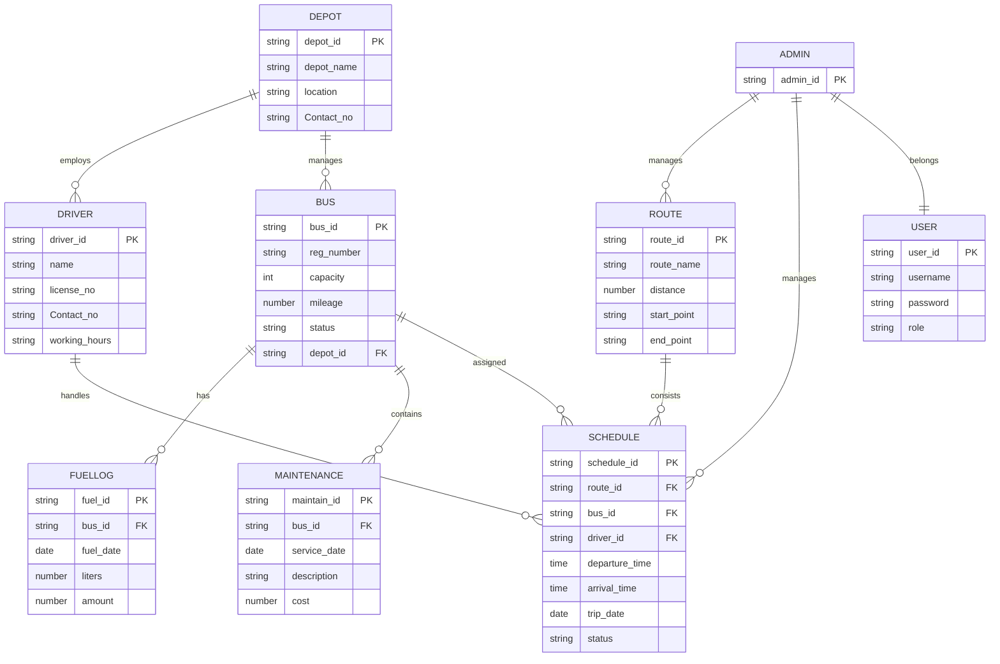

# TransitLK — Entity-Relationship (ER) Diagram

> **SRMSS** — Smart Route Management and Scheduling System for Public Transport Depots  
> This document describes the current ER model used for database design and implementation.

---

## Overview

The system models depot operations: depots employ drivers and manage buses; routes are planned by admins; schedules assign buses and drivers to routes on specific dates; fuel and maintenance are logged per bus. Users authenticate via a shared `User` entity linked to `Admin`.

---

## Entities and Attributes

### Depot

| Attribute   | Key | Description                    |
|------------|-----|--------------------------------|
| `depot_id` | PK  | Unique depot identifier        |
| `depot_name` |   | Name of the depot              |
| `location` |     | Depot location                 |
| `Contact_no` |   | Contact telephone number       |

### Driver

| Attribute      | Key | Description                    |
|---------------|-----|--------------------------------|
| `driver_id`   | PK  | Unique driver identifier       |
| `name`        |     | Driver full name               |
| `license_no`  |     | Driving licence number         |
| `Contact_no`  |     | Contact telephone number       |
| `working_hours` |   | Working hours / shift info     |

### Bus

| Attribute    | Key | Description                    |
|-------------|-----|--------------------------------|
| `bus_id`    | PK  | Unique bus identifier          |
| `reg_number`|     | Vehicle registration number    |
| `capacity`  |     | Seating capacity               |
| `mileage`   |     | Current mileage                |
| `status`    |     | e.g. available, in service     |
| `depot_id`  | FK  | Depot that manages this bus    |

### FuelLog

| Attribute   | Key | Description                    |
|------------|-----|--------------------------------|
| `fuel_id`  | PK  | Unique fuel log identifier     |
| `bus_id`   | FK  | Bus that was refuelled         |
| `fuel_date`|     | Date of fuel entry             |
| `liters`   |     | Fuel quantity (litres)         |
| `amount`   |     | Cost of fuel                   |

### Maintenance

| Attribute      | Key | Description                    |
|---------------|-----|--------------------------------|
| `maintain_id` | PK  | Unique maintenance record ID   |
| `bus_id`      | FK  | Bus serviced                   |
| `service_date`|     | Date of service                |
| `description` |   | Work performed                 |
| `cost`        |     | Service cost                   |

### Route

| Attribute     | Key | Description                    |
|--------------|-----|--------------------------------|
| `route_id`   | PK  | Unique route identifier        |
| `route_name` |     | Route name / label             |
| `distance`   |     | Total route distance           |
| `start_point`|     | Starting location              |
| `end_point`  |     | Destination location           |

### Schedule

| Attribute        | Key | Description                         |
|-----------------|-----|-------------------------------------|
| `schedule_id`   | PK  | Unique schedule / trip identifier   |
| `route_id`      | FK  | Route for this trip                 |
| `bus_id`        | FK  | Bus assigned to the trip            |
| `driver_id`     | FK  | Driver assigned to the trip         |
| `departure_time`|     | Scheduled departure time            |
| `arrival_time`  |     | Scheduled arrival time              |
| `trip_date`     |     | Date of the trip                    |
| `status`        |     | e.g. on-time, delayed, completed    |

### Admin

| Attribute  | Key | Description                    |
|-----------|-----|--------------------------------|
| `admin_id`| PK  | Unique admin identifier        |

### User

| Attribute  | Key | Description                              |
|-----------|-----|------------------------------------------|
| `user_id` | PK  | Unique user identifier                   |
| `username`|     | Login username                           |
| `password`|     | Hashed password (implementation)         |
| `role`    |     | e.g. admin, supervisor, staff            |

---

## Relationships and Cardinality

| Relationship | Entities        | Cardinality | Description                                      |
|-------------|-----------------|-------------|--------------------------------------------------|
| **employs** | Depot → Driver  | 1 : M       | One depot employs many drivers                   |
| **manages** | Depot → Bus   | 1 : M       | One depot manages many buses                     |
| **has**     | Bus → FuelLog   | 1 : M       | One bus has many fuel log entries                |
| **contains**| Bus → Maintenance | 1 : M     | One bus has many maintenance records             |
| **assigned**| Bus → Schedule  | 1 : M       | One bus is assigned to many schedules           |
| **handles** | Driver → Schedule | 1 : M   | One driver handles many schedules                |
| **consists**| Route → Schedule | 1 : M    | One route has many scheduled trips               |
| **manages** | Admin → Route   | 1 : M       | One admin manages many routes                    |
| **manages** | Admin → Schedule | 1 : M    | One admin manages many schedules                 |
| **belongs** | Admin → User    | 1 : 1       | One admin account links to one user record       |

---

## ER Diagram (Mermaid)

---

## Mapping to MongoDB / Mongoose (implementation notes)

In the MERN stack, primary keys are typically MongoDB `_id` (`ObjectId`). Foreign keys use `ObjectId` references:

| ER entity   | Mongoose collection | Notes |
|------------|---------------------|--------|
| User       | `users`             | Implemented (`User` model) — maps `username`/`email`, `password`, `role` |
| Route      | `routes`            | `route_name`, `distance`, `start_point`, `end_point` |
| Schedule   | `schedules`         | References `route`, `bus`, `driver` |
| Driver     | `drivers`           | Irfa |
| Bus        | `buses`             | Irfa — includes `depot_id` |
| FuelLog    | `fuellogs`          | Irfa |
| Maintenance| `maintenances`      | Irfa |
| Depot      | `depots`            | Optional early phase; `depot_id` on Bus |
| Admin      | —                   | May be merged with `User` where `role === 'admin'` |

### Route collection (from this ER)

Minimum fields aligned with the diagram:

- `route_name` (String, required)
- `distance` (Number, required)
- `start_point` (String, required)
- `end_point` (String, required)

Bus and driver assignment appear on **Schedule**, not on **Route**, in this ER model.

### Coursework brief vs ER

The coursework text (see `DOCUMENT.md`) also mentions **intermediary stops** and **bus/driver assignment on routes**. If you need those in the UI:

- Add optional `stops: [String]` on **Route** (extra attribute, not on original ER), or
- Rely on **Schedule** for `bus_id` and `driver_id` per trip (matches this ER).

Document any extensions in the group report so design matches implementation.

---

## Module ownership (implementation)

| ER area              | Primary owner |
|---------------------|---------------|
| Route               | Baanu         |
| Schedule            | Baanu         |
| Driver, Bus, FuelLog, Maintenance | Irfa |
| User / auth         | Baanu (done)  |
| Depot, Admin, Dashboard, Reports | Group / pending |

---

## Related documents

- `DOCUMENT.md` — Coursework brief and requirements
- UML class diagram, use case diagram, 3-tier architecture — `docs/` (add filenames as created)
- Wireframes / Stitch — design reference for UI
